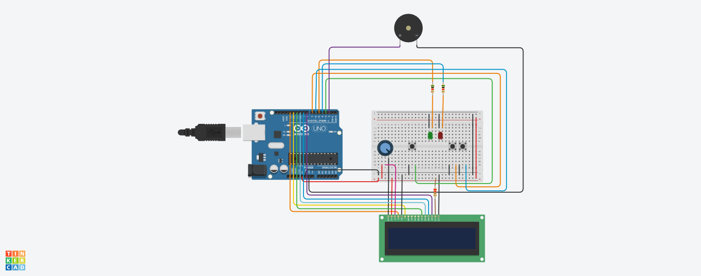

# Relatório do Projeto
## Introdução
Nesse projeto tivemos a tarefa de desenvolver um jogo de 3 fases dentro do micro-controlador Arduíno.
Desenvolvemos o circuito primeiramente no simulador [Tinkercad](https://www.tinkercad.com/) em paralelo com o código feito no Visual Studio Code.
Após isso desenvolvemos o circuito fisicamente Com o Arduíno.
Para desenvolver o circuito foi necessário:
- 1   Arduino Uno
- 1   LCD 16x2
- 1 	250 kΩ Potenciômetro
- 1 	220 Ω Resistor
- 3 	Botões
- 2 	5 kΩ Resistor
- 1 	Buzzer
- 1   Placa de Ensaio
- 1   LED Vermelho
- 1   LED Verde

### Fase 1) Jogo da Memória ->
  Essa fase tem o objetivo de testar a memória do jogador. Aqui criamos uma sequência aleatória de 10 repetições entre dois leds das cores verde e vermelho.
  Após a exibição da sequência o jogador deve apertar o botão correspondente a cada cor dos leds na ordem correta. 
  Tendo apenas uma chance para completar a sequência perfeitamente e passar para a próxima fase

### Fase 2) Jogo das Peguntas ->
  Essa fase tem o objetivo de testar os conhecimentos matemáticos basicos do jogador. Aqui Fazemos 5 perguntas aleatórias de matemática com respostas de __SIM OU NÃO__ com 10 segundos por pergunta para ser respondida.
  Caso o jogador erre uma única vez ele deverá recomeçar o jogo desde a fase 1, porém caso o jogador sinta necessidade ele tem a oportunidade de pular, uma única vez, a pergunta agurdando o tempo de resposta se esgotar e assim recebendo uma nova pergunta, não influenciando no número de perguntas respondidas.
  Apó responder corretamente 5 perguntas o jogador pode passar para a 3° e última fase do jogo

### Fase 3) Pergunta Final->
  Essa é a última fase do jogo, sendo apenas uma única pergunta de __SIM OU NÃO__ para determinar se o jogador vence o jogo ou perde e retorna desde o ínicio novamente. Nesta fase o jogador não tem a oportunidade de errar ou pular a questão. Caso ele acerte será exibido uma mensagem de sucesso junto a música representando a vitória do jogo, caso ele erre será exibido uma mensagem e musica representando a derrota

## Metodologia do Projeto
Neste projeto optamos por fazer o código de forma mais organizada sendo inteiramente orquestrado em funções, tendo 3 funções principais, uma para cada fase e variáveis booleanas para controlar a progressão de fases.
Utilizamos apensa uma interrupção para controlar o botão de iniciar/desistir, caso o jogador queira recomeçar o jogo durante a execução do programa basta apertar o botão de início para fazer a reversão de dos booleanos criados e assim recomeçar o jogo.
Outra característica do projeto foi economizar a memória do Arduíno para evitar problemas, dessa forma organizamos as perguntas em vetores e utilizamos os índices para determinar as repostas. Para assim não ter a necessidade de armazenar na memória as respostas para as perguntas 
  

## Conclusao
O projeto foi desafiador, mas conseguimos superar os problemas desenvolvendo o jogo com a lógica de dividir cada fase como um jogos independênte, controlando a progressão apenas com uma variável para cada fase
Desta forma podemos desenvolver individualmente cada fase, o que facilitou nos testes e para ter uma experiência final mais flúida para o usuário.
Desta enfrentamos algumas dificuldades no princípio do projeto para conseguir organizar o código de forma intuitiva e otimizada, porém essa dificuldade logo foi superada com a progressão do projeto.

## Vídeo
Para teste deixamos o led com um intervalo de 5 repetições para melhorar a vizualização:
O vídeo se encontra nesse caminho na pasta "img" com o seguinte nome: "Projeto arduino - 1728258890198.mp4".

